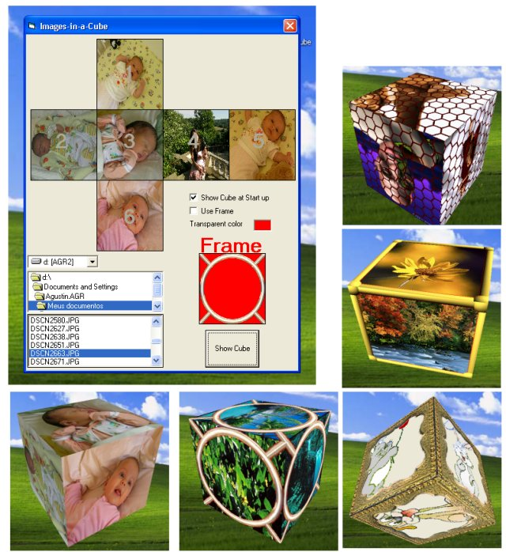



## Images\-in\-a\-Cube

### Description

The name says all. It uses OPENGL and requires Windows XP.
 
### More Info
 

             |
---                |---
**Submitted On**   |2006-01-05 18:25:02
**By**             |[Agustin Rodriguez](https://github.com/Planet-Source-Code/PSCIndex/blob/master/ByAuthor/agustin-rodriguez.md)
**Level**          |Intermediate
**User Rating**    |4.9 (168 globes from 34 users)
**Compatibility**  |VB 6\.0
**Category**       |[Graphics](https://github.com/Planet-Source-Code/PSCIndex/blob/master/ByCategory/graphics__1-46.md)
**World**          |[Visual Basic](https://github.com/Planet-Source-Code/PSCIndex/blob/master/ByWorld/visual-basic.md)
**Archive File**   |[Images\-in\-196292162006\.zip](https://github.com/Planet-Source-Code/agustin-rodriguez-images-in-a-cube__1-63946/archive/master.zip)

